# WaaS — Messaging-as-a-Service Gateway: Discovery Document

> **Canonical reference document.** Consolidates all architectural decisions produced during the WaaS Gateway discovery.
>
> **Created:** June/2026
> **Version:** 1.0.0

---

## Table of Contents

1. [Project Overview](#1-project-overview)
2. [Bounded Contexts](#2-bounded-contexts)
3. [Context Map](#3-context-map)
4. [Domain Class Diagram](#4-domain-class-diagram)
5. [State Diagrams](#5-state-diagrams)
6. [Sequence Diagrams](#6-sequence-diagrams)
7. [ER Diagram](#7-er-diagram)
8. [Package Diagram](#8-package-diagram)
9. [Deployment Diagram](#9-deployment-diagram)
10. [Ports & Adapters](#10-ports--adapters)
11. [Applied Design Patterns](#11-applied-design-patterns)
12. [NFRs — Non-Functional Requirements](#12-nfrs--non-functional-requirements)
13. [Domain Events Contract](#13-domain-events-contract)
14. [Testing Strategy](#14-testing-strategy)
15. [Development Process](#15-development-process)
16. [References](#16-references)

---

## 1. Project Overview

### Name

**WaaS — Messaging-as-a-Service Gateway**

### Problem

Systems that need to send or receive messages via WhatsApp, SMS, or other messaging channels face direct coupling to SDKs, proprietary APIs, and provider-specific lifecycles. This results in:

- **Vendor lock-in** — switching providers requires rewriting business logic.
- **Operational complexity** — each provider has its own connection model, authentication, retry, and rate limit mechanisms.
- **Duplication** — multiple systems reimplement the same messaging infrastructure.

WaaS solves this by abstracting messaging providers behind **adaptive contracts** (ports), exposing a unified API that any consumer system can integrate in a plug-and-play fashion.

### Technology Stack

| Layer | Technology | Version |
|---|---|---|
| Runtime | Node.js | 22 LTS |
| Language | TypeScript | 5 |
| HTTP Framework | NestJS | 11 |
| ORM | Prisma | latest stable |
| Database | PostgreSQL | 16 |
| Cache / Pub-Sub | Redis | 7 |
| Job Queue | BullMQ | 5 |
| WhatsApp Provider | Baileys | community fork |

### Architecture

**Clean Architecture + Hexagonal Architecture + Domain-Driven Design**

- The **domain** is at the center — with no dependencies on frameworks or infrastructure.
- **Ports** define contracts the domain expects; **Adapters** implement those contracts.
- **Bounded Contexts** segregate responsibilities with clear linguistic and transactional boundaries.
- **Transactional Outbox** ensures eventual consistency between local state and published events.

### First Consumer

**Play Sports Falcão** — a sports court management platform that will use WaaS for booking confirmations and notifications via WhatsApp.

### Project Nature

- Independent and self-contained microservice
- Open-source license, community-focused
- Designed to be generic — Play Sports is the first consumer, not the only one

---

## 2. Bounded Contexts

The WaaS domain is divided into **4 bounded contexts**:

### 2.1 Workspace

Responsibility: **multi-tenancy and resource isolation**.

- Manages workspaces (tenants) and their API keys.
- Defines usage limits (rate limits, quotas).
- Entry point for provisioning new consumers.

**Ubiquitous language:** Workspace, ApiKey, Quota, Tenant.

### 2.2 Channel Management

Responsibility: **communication channel lifecycle**.

- Creates, connects, reconnects, and disconnects channels (e.g., a WhatsApp session via Baileys).
- Manages encrypted credentials and per-provider configuration.
- Maintains the channel state machine (CREATED → CONNECTED → DISCONNECTED).

**Ubiquitous language:** Channel, ChannelConfig, EncryptedCreds, QrCode, ProviderType.

### 2.3 Messaging

Responsibility: **sending, receiving, and tracking messages**.

- Accepts send commands (text, media, template).
- Tracks delivery attempts and status (SENT, DELIVERED, READ, FAILED).
- Implements retry with exponential backoff and dead-lettering.
- Processes inbound messages received from providers.

**Ubiquitous language:** Message, DeliveryAttempt, MessageContent, RetryPolicy, FailureReason.

### 2.4 Notification

Responsibility: **event propagation to external systems**.

- Consumes domain events via outbox and delivers them to configured webhooks.
- Supports SSE (Server-Sent Events) for clients that prefer real-time push.
- Manages webhook configs (URL, secret, retry policy).

**Ubiquitous language:** WebhookConfig, EventDelivery, NotificationChannel.

### Provider — Infrastructure, Not a Bounded Context

**Providers (Baileys, future SMS SDKs, etc.) are infrastructure adapters**, not bounded contexts. They implement ports defined by the domain (`IProviderLifecycle`, `IMessageSender`, `IProviderEventSource`) and live in the infrastructure layer.

Rationale: a provider has no ubiquitous language of its own nor business rules — it translates domain contracts to external APIs. Treating it as a BC would inflate the architecture with no semantic gain (YAGNI).

---

## 3. Context Map

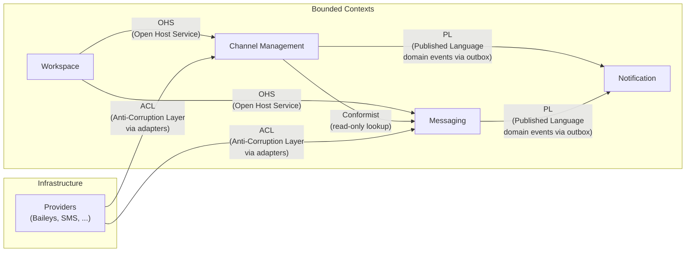

### Relationship Details

| Upstream | Downstream | Pattern | Rationale |
|---|---|---|---|
| **Workspace** | Channel Management | **Open Host Service** | Workspace exposes a well-defined internal API that Channel Management consumes to resolve tenant and validate quotas. The downstream does not need to adapt — the contract is stable and controlled by the upstream. |
| **Workspace** | Messaging | **Open Host Service** | Same reasoning: Messaging queries Workspace to validate API keys and resolve tenant context. |
| **Channel Management** | Messaging | **Conformist** | Messaging needs to know if a channel is connected before dispatching messages. It performs a read-only lookup on the channel state, conforming to Channel Management's model without translating it. |
| **Channel Management** | Notification | **Published Language** | Channel Management publishes domain events (ChannelConnected, ChannelDisconnected, etc.) via transactional outbox. Notification consumes these events using the shared schema (DomainEventEnvelope). |
| **Messaging** | Notification | **Published Language** | Messaging publishes message lifecycle events (MessageSent, MessageDelivered, etc.) via outbox. Same published language mechanism. |
| **Providers** | Channel/Messaging | **ACL (Anti-Corruption Layer)** | Provider adapters translate external models (Baileys Session, WhatsApp Message Receipt) into domain value objects, preventing external concepts from leaking into bounded contexts. |

---

## 4. Domain Class Diagram

```mermaid
classDiagram
    direction TB

    %% === AGGREGATES ===

    class Channel {
        <<Aggregate Root>>
        +id: string
        +workspaceId: string
        +name: string
        +providerType: ProviderType
        +status: ChannelStatus
        +config: ChannelConfig
        +credentials: EncryptedCreds
        +createdAt: Date
        +updatedAt: Date
        +connect(): void
        +disconnect(): void
        +markQrPending(qrCode: string): void
        +markConnected(): void
        +markReconnecting(): void
        +markDisconnected(reason: FailureReason): void
        +markFailed(reason: FailureReason): void
    }

    class Message {
        <<Aggregate Root>>
        +id: string
        +workspaceId: string
        +channelId: string
        +direction: MessageDirection
        +to: PhoneNumber
        +from: PhoneNumber
        +content: MessageContent
        +status: MessageStatus
        +idempotencyKey: string
        +providerRef: ProviderMessageRef
        +retryPolicy: RetryPolicy
        +scheduledAt: Date | null
        +createdAt: Date
        +updatedAt: Date
        +markQueued(): void
        +markScheduled(at: Date): void
        +markSending(): void
        +markSent(ref: ProviderMessageRef): void
        +markDelivered(): void
        +markRead(): void
        +markFailed(reason: FailureReason): void
        +markRetrying(): void
        +markDeadLettered(): void
        +addAttempt(attempt: DeliveryAttempt): void
    }

    class Workspace {
        <<Aggregate Root>>
        +id: string
        +name: string
        +slug: string
        +apiKeys: ApiKey[]
        +isActive: boolean
        +createdAt: Date
        +updatedAt: Date
        +generateApiKey(name: string): ApiKey
        +revokeApiKey(keyId: string): void
        +deactivate(): void
    }

    %% === ENTITIES ===

    class DeliveryAttempt {
        <<Entity>>
        +id: string
        +messageId: string
        +attemptNumber: number
        +status: AttemptStatus
        +providerResponse: string | null
        +failureReason: FailureReason | null
        +startedAt: Date
        +completedAt: Date | null
        +durationMs: number | null
    }

    class ApiKey {
        <<Entity>>
        +id: string
        +workspaceId: string
        +name: string
        +keyHash: string
        +prefix: string
        +isActive: boolean
        +createdAt: Date
        +revokedAt: Date | null
    }

    %% === VALUE OBJECTS ===

    class PhoneNumber {
        <<Value Object>>
        +countryCode: string
        +number: string
        +toString(): string
        +equals(other: PhoneNumber): boolean
        +static create(raw: string): PhoneNumber
    }

    class MessageContent {
        <<Value Object>>
        +type: ContentType
        +body: string
        +mediaUrl: string | null
        +mimeType: string | null
        +templateId: string | null
        +templateParams: Record~string, string~ | null
    }

    class ChannelConfig {
        <<Value Object>>
        +maxConcurrentSessions: number
        +retryPolicy: RetryPolicy
        +webhookUrl: string | null
        +metadata: Record~string, unknown~
    }

    class EncryptedCreds {
        <<Value Object>>
        +encryptedPayload: Buffer
        +algorithm: string
        +keyVersion: number
        +decrypt(masterKey: Buffer): Record~string, unknown~
        +static encrypt(plain: Record~string, unknown~, masterKey: Buffer): EncryptedCreds
    }

    class ProviderMessageRef {
        <<Value Object>>
        +providerId: string
        +externalId: string
        +timestamp: Date
    }

    class FailureReason {
        <<Value Object>>
        +code: string
        +message: string
        +isRetryable: boolean
        +providerErrorCode: string | null
    }

    class RetryPolicy {
        <<Value Object>>
        +maxAttempts: number
        +initialDelayMs: number
        +backoffMultiplier: number
        +maxDelayMs: number
        +shouldRetry(attempt: number, reason: FailureReason): boolean
    }

    %% === DOMAIN SERVICES ===

    class MessageDispatcher {
        <<Domain Service>>
        +dispatch(message: Message, channel: Channel): Promise~void~
    }

    %% === ENUMS ===

    class ProviderType {
        <<Enumeration>>
        BAILEYS
        EVOLUTION_API
        TWILIO
        IN_MEMORY
    }

    class ChannelStatus {
        <<Enumeration>>
        CREATED
        CONNECTING
        QR_PENDING
        CONNECTED
        RECONNECTING
        DISCONNECTED
        FAILED
    }

    class MessageStatus {
        <<Enumeration>>
        PENDING
        QUEUED
        SCHEDULED
        SENDING
        SENT
        DELIVERED
        READ
        FAILED
        RETRYING
        DEAD_LETTERED
        RECEIVED
    }

    class MessageDirection {
        <<Enumeration>>
        OUTBOUND
        INBOUND
    }

    class ContentType {
        <<Enumeration>>
        TEXT
        IMAGE
        VIDEO
        AUDIO
        DOCUMENT
        TEMPLATE
    }

    %% === PORTS ===

    class IProviderLifecycle {
        <<Port>>
        +connect(channel: Channel): Promise~void~
        +disconnect(channelId: string): Promise~void~
        +getStatus(channelId: string): Promise~ChannelStatus~
    }

    class IMessageSender {
        <<Port>>
        +sendText(channelId: string, to: PhoneNumber, body: string): Promise~ProviderMessageRef~
        +sendMedia(channelId: string, to: PhoneNumber, mediaUrl: string, mimeType: string, caption?: string): Promise~ProviderMessageRef~
        +sendTemplate(channelId: string, to: PhoneNumber, templateId: string, params: Record~string, string~): Promise~ProviderMessageRef~
    }

    class IProviderEventSource {
        <<Port>>
        +onMessageReceived(handler: (event: InboundMessageEvent) => void): void
        +onStatusChanged(handler: (event: StatusChangeEvent) => void): void
    }

    class IChannelRepository {
        <<Port>>
        +findById(id: string): Promise~Channel | null~
        +findByWorkspace(workspaceId: string): Promise~Channel[]~
        +save(channel: Channel): Promise~void~
        +delete(id: string): Promise~void~
    }

    class IMessageRepository {
        <<Port>>
        +findById(id: string): Promise~Message | null~
        +findByIdempotencyKey(key: string): Promise~Message | null~
        +findByChannel(channelId: string, pagination: PaginationParams): Promise~PaginatedResult~Message~~
        +save(message: Message): Promise~void~
    }

    class IOutboxRepository {
        <<Port>>
        +store(event: DomainEvent): Promise~void~
        +fetchPending(batchSize: number): Promise~OutboxEvent[]~
        +markPublished(eventId: string): Promise~void~
        +markFailed(eventId: string, reason: string): Promise~void~
    }

    class IEventPublisher {
        <<Port>>
        +publish(event: DomainEvent): Promise~void~
        +publishBatch(events: DomainEvent[]): Promise~void~
    }

    %% === RELATIONSHIPS ===

    Workspace "1" *-- "0..*" ApiKey : contains
    Channel "1" -- "1" ChannelConfig : has
    Channel "1" -- "1" EncryptedCreds : has
    Channel "1" -- "1" ChannelStatus : has status
    Channel "1" -- "1" ProviderType : uses
    Message "1" *-- "0..*" DeliveryAttempt : tracks
    Message "1" -- "1" MessageContent : carries
    Message "1" -- "1" PhoneNumber : to
    Message "1" -- "1" PhoneNumber : from
    Message "1" -- "0..1" ProviderMessageRef : references
    Message "1" -- "1" RetryPolicy : follows
    Message "1" -- "1" MessageStatus : has status
    DeliveryAttempt "1" -- "0..1" FailureReason : explains
    Channel "1" -- "0..1" FailureReason : last failure
    MessageDispatcher ..> IMessageSender : uses
    MessageDispatcher ..> IChannelRepository : queries
```

---

## 5. State Diagrams

### 5.1 Channel Lifecycle

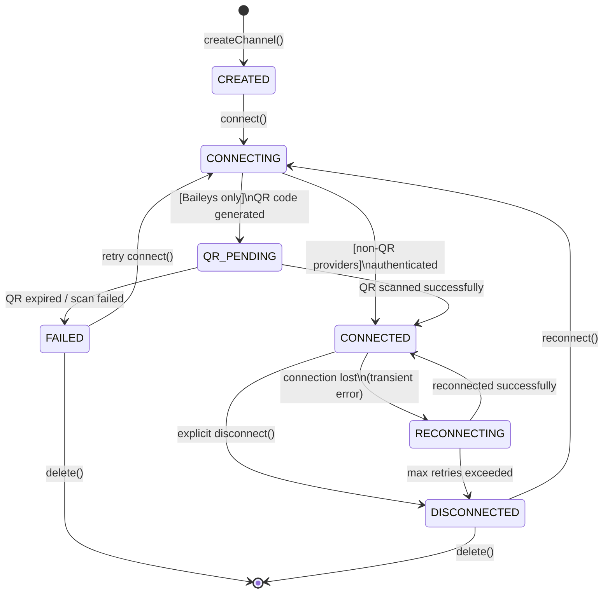

**Notes:**

- `QR_PENDING` is exclusive to QR code-based providers (Baileys). Providers with API key/token authentication transition directly from `CONNECTING` to `CONNECTED`.
- `RECONNECTING` is automatic — the system attempts to reconnect with exponential backoff before giving up.
- `FAILED` is terminal until explicit intervention (retry or delete).

### 5.2 Message Lifecycle — Outbound

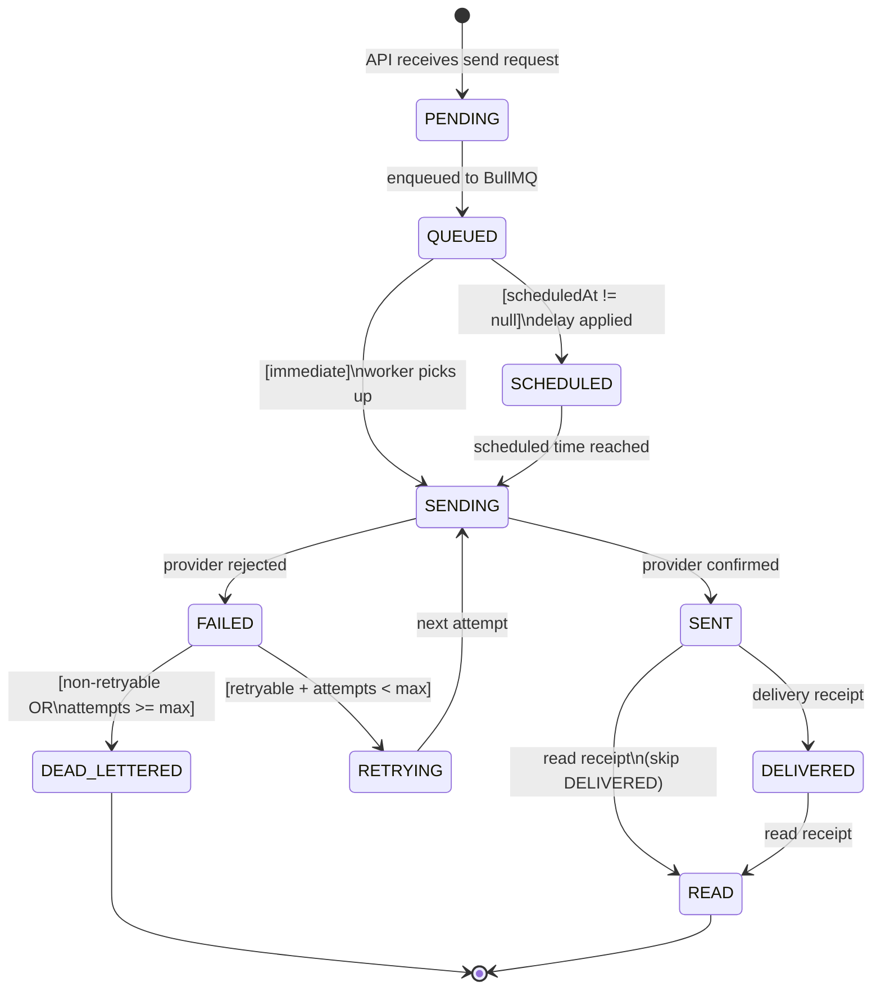

### 5.3 Message Lifecycle — Inbound

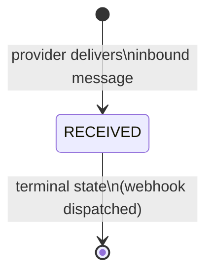

**Notes:**

- Inbound messages do not go through a queue — they are received by the provider adapter, persisted as `RECEIVED`, and immediately dispatched via webhook/SSE.
- `RECEIVED` is the only state for inbound messages and is terminal.

---

## 6. Sequence Diagrams

### 6.1 Connect Channel — QR Flow (Baileys)

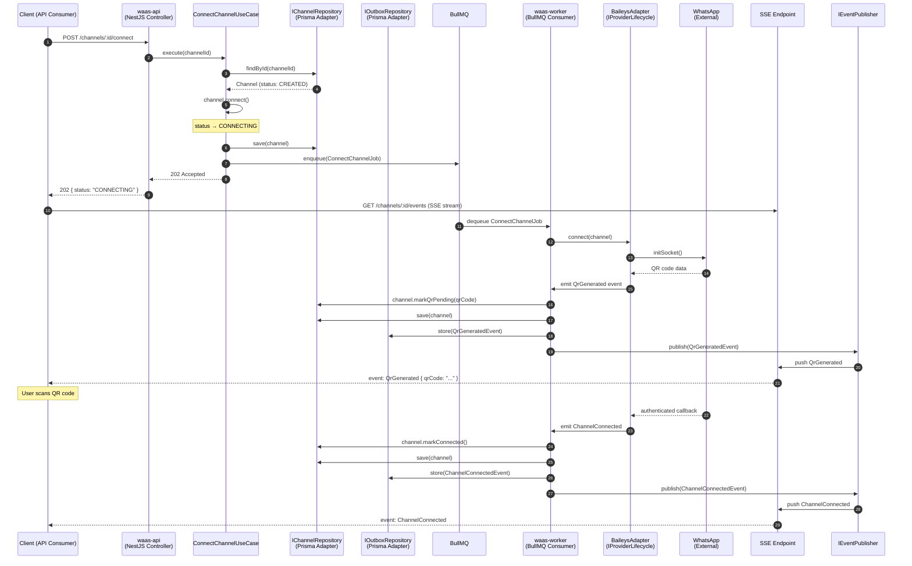

### 6.2 Send Message — Happy Path with Outbox

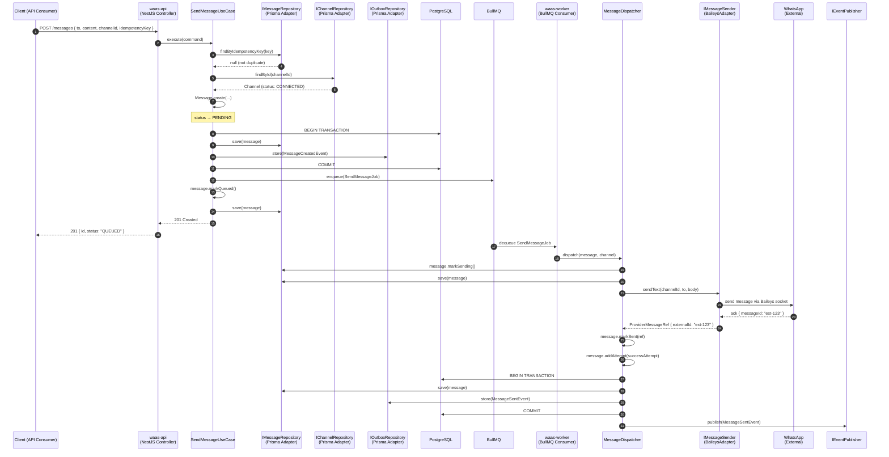

### 6.3 Failure and Retry with Circuit Breaker

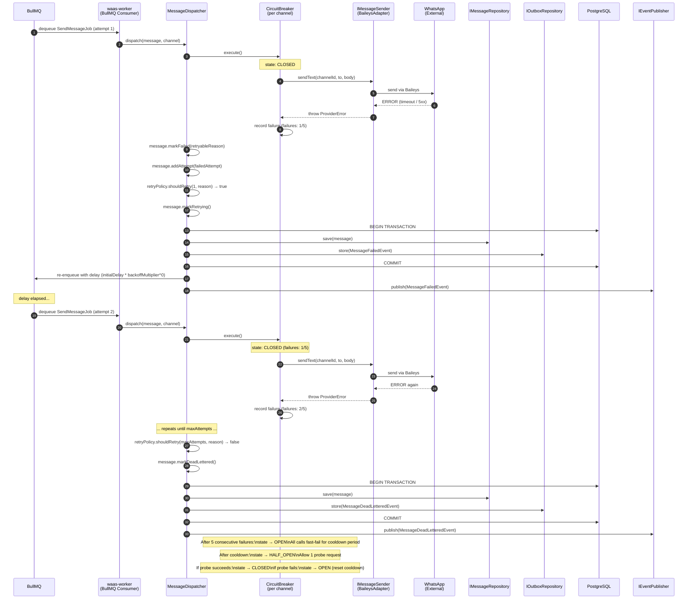

### 6.4 Receive Inbound Message and Dispatch Webhook

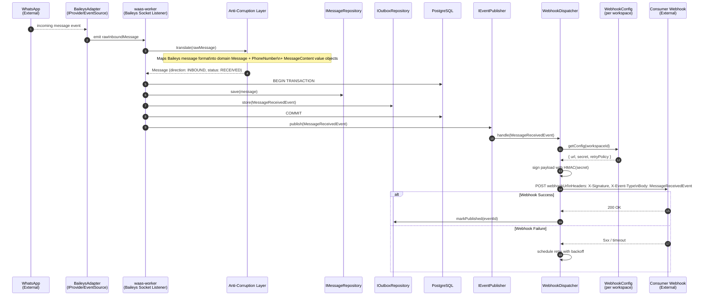

---

## 7. ER Diagram

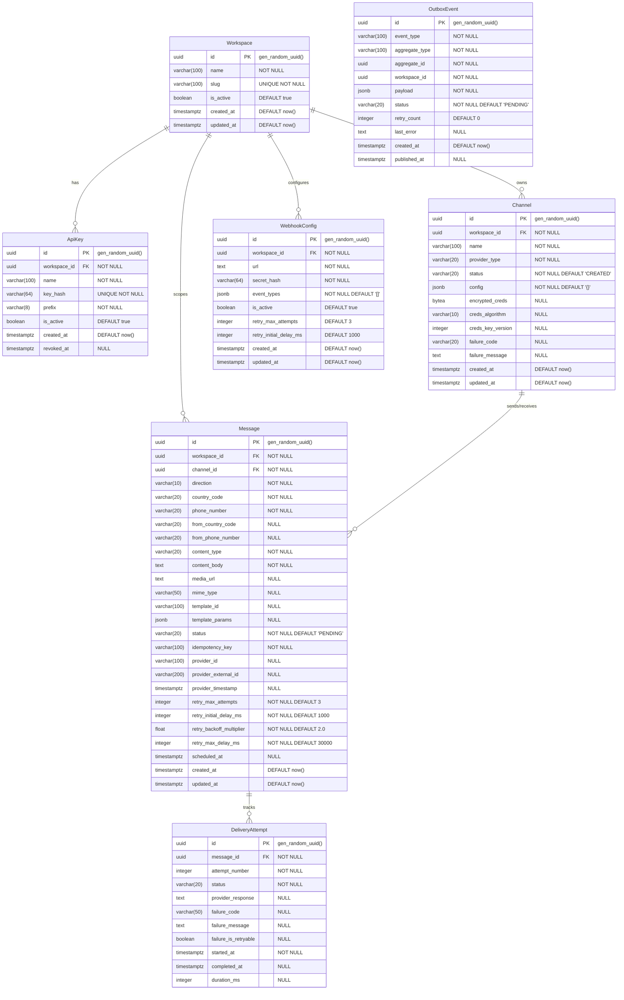

### Indexes

| Table | Index | Columns | Type |
|---|---|---|---|
| `ApiKey` | `idx_apikey_hash` | `key_hash` | UNIQUE |
| `ApiKey` | `idx_apikey_workspace` | `workspace_id` | B-tree |
| `Channel` | `idx_channel_workspace` | `workspace_id` | B-tree |
| `Channel` | `idx_channel_workspace_status` | `workspace_id, status` | B-tree |
| `Message` | `idx_message_idempotency` | `idempotency_key` | UNIQUE |
| `Message` | `idx_message_channel` | `channel_id` | B-tree |
| `Message` | `idx_message_workspace_created` | `workspace_id, created_at DESC` | B-tree |
| `Message` | `idx_message_status` | `status` | B-tree (partial: WHERE status NOT IN ('READ', 'DEAD_LETTERED', 'RECEIVED')) |
| `DeliveryAttempt` | `idx_attempt_message` | `message_id` | B-tree |
| `OutboxEvent` | `idx_outbox_pending` | `status, created_at` | B-tree (partial: WHERE status = 'PENDING') |
| `OutboxEvent` | `idx_outbox_aggregate` | `aggregate_type, aggregate_id` | B-tree |
| `WebhookConfig` | `idx_webhook_workspace` | `workspace_id` | B-tree |

---

## 8. Package Diagram

```mermaid
graph TB
    subgraph src["src/"]
        subgraph domain["domain/ — Pure business rules"]
            subgraph dm_ch["channel-management/"]
                CH_E["entities/Channel.ts"]
                CH_VO["value-objects/ChannelConfig.ts\nEncryptedCreds.ts"]
                CH_EV["events/ChannelCreated.ts\nQrGenerated.ts\nChannelConnected.ts\nChannelDisconnected.ts\nChannelFailed.ts"]
                CH_EN["enums/ChannelStatus.ts\nProviderType.ts"]
            end
            subgraph dm_msg["messaging/"]
                MSG_E["entities/Message.ts\nDeliveryAttempt.ts"]
                MSG_VO["value-objects/PhoneNumber.ts\nMessageContent.ts\nProviderMessageRef.ts\nFailureReason.ts\nRetryPolicy.ts"]
                MSG_SVC["services/MessageDispatcher.ts"]
                MSG_EV["events/MessageCreated.ts\nMessageSent.ts\nMessageDelivered.ts\nMessageRead.ts\nMessageFailed.ts\nMessageDeadLettered.ts\nMessageReceived.ts"]
                MSG_EN["enums/MessageStatus.ts\nMessageDirection.ts\nContentType.ts"]
            end
            subgraph dm_ws["workspace/"]
                WS_E["entities/Workspace.ts\nApiKey.ts"]
            end
            subgraph dm_ports["shared/ports/"]
                P1["IProviderLifecycle.ts"]
                P2["IMessageSender.ts"]
                P3["IProviderEventSource.ts"]
                P4["IChannelRepository.ts"]
                P5["IMessageRepository.ts"]
                P6["IOutboxRepository.ts"]
                P7["IEventPublisher.ts"]
            end
            subgraph dm_shared["shared/"]
                SH["DomainEvent.ts\nDomainEventEnvelope.ts\nEntity.ts\nAggregateRoot.ts\nValueObject.ts"]
            end
        end

        subgraph application["application/ — Use case orchestration"]
            subgraph uc["use-cases/"]
                UC1["ConnectChannelUseCase.ts"]
                UC2["DisconnectChannelUseCase.ts"]
                UC3["SendMessageUseCase.ts"]
                UC4["GetChannelStatusUseCase.ts"]
                UC5["ListMessagesUseCase.ts"]
                UC6["CreateWorkspaceUseCase.ts"]
                UC7["GenerateApiKeyUseCase.ts"]
            end
        end

        subgraph infrastructure["infrastructure/ — Concrete implementations"]
            subgraph prov_baileys["providers/baileys/"]
                BA1["BaileysLifecycleAdapter.ts"]
                BA2["BaileysMessageSenderAdapter.ts"]
                BA3["BaileysEventSourceAdapter.ts"]
                BA4["BaileysSocketManager.ts"]
                BA5["BaileysACL.ts"]
            end
            subgraph prov_inmem["providers/inmemory/"]
                IM1["InMemoryLifecycleAdapter.ts"]
                IM2["InMemoryMessageSenderAdapter.ts"]
                IM3["InMemoryEventSourceAdapter.ts"]
            end
            subgraph persist["persistence/prisma/"]
                PR1["PrismaChannelRepository.ts"]
                PR2["PrismaMessageRepository.ts"]
                PR3["PrismaOutboxRepository.ts"]
                PR4["PrismaWorkspaceRepository.ts"]
                PR5["schema.prisma"]
            end
            subgraph queue["queue/"]
                Q1["BullMQProducer.ts"]
                Q2["BullMQConsumer.ts"]
                Q3["jobs/SendMessageJob.ts"]
                Q4["jobs/ConnectChannelJob.ts"]
            end
            subgraph webhook["webhook/"]
                WH1["WebhookDispatcher.ts"]
                WH2["HmacSigner.ts"]
            end
            subgraph circuit["circuit-breaker/"]
                CB1["CircuitBreaker.ts"]
                CB2["CircuitBreakerRegistry.ts"]
            end
            subgraph outbox_infra["outbox/"]
                OB1["OutboxPoller.ts"]
                OB2["OutboxPublisher.ts"]
            end
        end

        subgraph interfaces["interfaces/ — Entry points"]
            subgraph http["http/controllers/"]
                C1["ChannelController.ts"]
                C2["MessageController.ts"]
                C3["WorkspaceController.ts"]
                C4["HealthController.ts"]
            end
            subgraph sse["events/sse/"]
                SSE1["SseGateway.ts"]
            end
            subgraph middleware["http/middleware/"]
                MW1["ApiKeyAuthGuard.ts"]
                MW2["IdempotencyInterceptor.ts"]
                MW3["RateLimitGuard.ts"]
            end
        end
    end

    application --> domain
    infrastructure --> domain
    interfaces --> application
    interfaces -.->|"NestJS DI"| infrastructure
```

**Dependency rule:** arrows point inward — `interfaces` and `infrastructure` depend on `application`, which depends on `domain`. The domain depends on nothing external.

---

## 9. Deployment Diagram

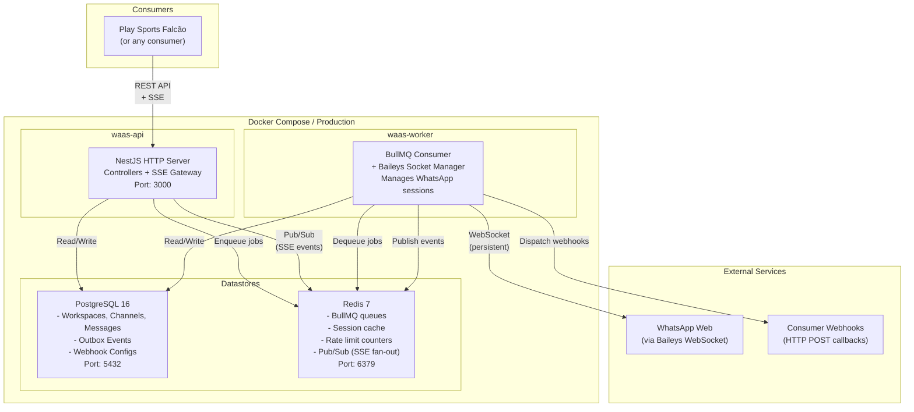

### Process Details

| Process | Responsibility | Scaling |
|---|---|---|
| **waas-api** | Receives HTTP requests, validates API keys, executes use cases, serves SSE stream. Stateless. | Horizontal — multiple replicas behind a load balancer. |
| **waas-worker** | Consumes BullMQ jobs, manages Baileys sockets, executes retries, publishes events, dispatches webhooks. Stateful (sockets). | Vertical per channel — each worker manages N channels. Partitioning by channel ID for affinity. |
| **PostgreSQL** | Source of truth for all persistent state. Transactional outbox lives here. | Single primary. Read replicas if needed. |
| **Redis** | BullMQ queues, pub/sub for SSE fan-out, session cache, rate limit counters. | Sentinel or cluster for HA. |

---

## 10. Ports & Adapters — Full Contracts

### 10.1 Provider Ports (Segregated — ISP)

The decision to segregate `IMessagingProvider` into 3 interfaces came from dialectical review. Rationale: not every adapter needs to implement all behaviors — a provider may support sending but not real-time events, or vice-versa.

```typescript
/**
 * Port: Provider lifecycle (connection, disconnection, status).
 * Adapters: BaileysLifecycleAdapter, InMemoryLifecycleAdapter
 */
interface IProviderLifecycle {
  /**
   * Initiates connection with the provider for a specific channel.
   * For Baileys: creates socket, starts auth, may generate QR code.
   * Emits domain events as the lifecycle progresses.
   */
  connect(channel: Channel): Promise<void>;

  /**
   * Gracefully terminates the connection with the provider.
   * Releases resources (sockets, listeners).
   */
  disconnect(channelId: string): Promise<void>;

  /**
   * Queries the current connection status from the provider.
   * Does not alter state — read-only.
   */
  getStatus(channelId: string): Promise<ChannelStatus>;
}

/**
 * Port: Message sending via provider.
 * Adapters: BaileysMessageSenderAdapter, InMemoryMessageSenderAdapter
 */
interface IMessageSender {
  /**
   * Sends a plain text message.
   * Returns provider reference for tracking.
   */
  sendText(
    channelId: string,
    to: PhoneNumber,
    body: string,
  ): Promise<ProviderMessageRef>;

  /**
   * Sends a media message (image, video, audio, document).
   * mediaUrl can be a public URL or base64 data URI.
   */
  sendMedia(
    channelId: string,
    to: PhoneNumber,
    mediaUrl: string,
    mimeType: string,
    caption?: string,
  ): Promise<ProviderMessageRef>;

  /**
   * Sends a template-based message (HSM for WhatsApp Business).
   * templateId is the template identifier at the provider.
   */
  sendTemplate(
    channelId: string,
    to: PhoneNumber,
    templateId: string,
    params: Record<string, string>,
  ): Promise<ProviderMessageRef>;
}

/**
 * Port: Receiving events from the provider (push model).
 * Adapters: BaileysEventSourceAdapter, InMemoryEventSourceAdapter
 */
interface IProviderEventSource {
  /**
   * Registers a handler for inbound messages received by the provider.
   * The adapter translates the native format (ACL) to InboundMessageEvent.
   */
  onMessageReceived(
    handler: (event: InboundMessageEvent) => void | Promise<void>,
  ): void;

  /**
   * Registers a handler for status changes (delivery receipts, read receipts).
   * The adapter translates provider status codes to StatusChangeEvent.
   */
  onStatusChanged(
    handler: (event: StatusChangeEvent) => void | Promise<void>,
  ): void;
}
```

### 10.2 Repository Ports

```typescript
/**
 * Port: Channel persistence.
 * Adapter: PrismaChannelRepository
 */
interface IChannelRepository {
  findById(id: string): Promise<Channel | null>;
  findByWorkspace(workspaceId: string): Promise<Channel[]>;
  findByWorkspaceAndStatus(
    workspaceId: string,
    status: ChannelStatus,
  ): Promise<Channel[]>;
  save(channel: Channel): Promise<void>;
  delete(id: string): Promise<void>;
}

/**
 * Port: Message persistence.
 * Adapter: PrismaMessageRepository
 */
interface IMessageRepository {
  findById(id: string): Promise<Message | null>;
  findByIdempotencyKey(key: string): Promise<Message | null>;
  findByChannel(
    channelId: string,
    pagination: PaginationParams,
  ): Promise<PaginatedResult<Message>>;
  findByWorkspace(
    workspaceId: string,
    filters: MessageFilters,
    pagination: PaginationParams,
  ): Promise<PaginatedResult<Message>>;
  save(message: Message): Promise<void>;
}

/**
 * Port: Transactional Outbox.
 * Adapter: PrismaOutboxRepository
 *
 * Ensures at-least-once delivery: events are persisted in the same
 * transaction as the state change, and published asynchronously.
 */
interface IOutboxRepository {
  store(event: DomainEvent): Promise<void>;
  storeBatch(events: DomainEvent[]): Promise<void>;
  fetchPending(batchSize: number): Promise<OutboxEvent[]>;
  markPublished(eventId: string): Promise<void>;
  markFailed(eventId: string, reason: string): Promise<void>;
}
```

### 10.3 Event Publisher Port

```typescript
/**
 * Port: Domain event publishing.
 * Adapter: RedisEventPublisher (Pub/Sub for SSE fan-out)
 *
 * Separate from the outbox — the outbox ensures persistence,
 * the publisher ensures real-time delivery.
 */
interface IEventPublisher {
  publish(event: DomainEvent): Promise<void>;
  publishBatch(events: DomainEvent[]): Promise<void>;
}
```

---

## 11. Applied Design Patterns

### 11.1 GoF Patterns

| Pattern | Where Applied | Why |
|---|---|---|
| **Strategy** | Provider adapters (`IMessageSender`, `IProviderLifecycle`) | Allows swapping the sending/connection algorithm at runtime without changing the domain. Baileys, InMemory, future Twilio — all implement the same interface, selected by `ProviderType`. |
| **State** | `Channel.status` and `Message.status` with controlled transitions | Encapsulates state transition rules within the aggregate. Methods like `markConnected()` validate preconditions (you can't go from `CREATED` directly to `CONNECTED`). Eliminates scattered switch/case. |
| **Observer** | Domain events (`ChannelConnected`, `MessageSent`, etc.) | Decouples side effects (webhook, SSE, logging) from core logic. The aggregate registers events; handlers react without the aggregate knowing who is listening. |
| **Factory Method** | `Message.create()`, `PhoneNumber.create()`, `EncryptedCreds.encrypt()` | Centralizes validation and invariants at creation. `PhoneNumber.create("11999999999")` validates format and returns an immutable value object or fails — never an invalid object. |
| **Decorator / Pipeline** | NestJS Interceptors: retry, rate limit, idempotency, logging | Adds cross-cutting behavior (rate limit, idempotency check) without modifying controllers or use cases. Layered composition — each interceptor does one thing. |
| **Repository** | `IChannelRepository`, `IMessageRepository`, `IOutboxRepository` | Abstracts persistence — the domain works with interfaces, not Prisma/SQL. Allows swapping storage without touching business rules. Enables testing with in-memory implementations. |
| **Facade** | `MessageDispatcher` (domain service) | Simplifies sending orchestration: resolve channel → check circuit breaker → call sender → handle result → record attempt. Consumers call one method, not five. |
| **Adapter** | `BaileysACL`, `BaileysMessageSenderAdapter`, etc. | Translates the Baileys interface (callbacks, raw events, proprietary types) to domain ports. The Anti-Corruption Layer prevents Baileys concepts from leaking into the domain. |

### 11.2 GRASP Principles

| Principle | Where Applied | Why |
|---|---|---|
| **Information Expert** | `Message` manages its own `DeliveryAttempt`s and state transitions | The aggregate that has the information (current status, retry policy, attempts) is the one that decides whether it can transition. `message.markFailed(reason)` — the Message knows whether to go to RETRYING or DEAD_LETTERED because it has the retryPolicy and the attempt count. |
| **Creator** | `Workspace.generateApiKey()`, `Message.addAttempt()` | Whoever contains, aggregates, or intimately uses an object is the one that should create it. Workspace creates ApiKeys; Message creates DeliveryAttempts. Maintains aggregate invariants. |
| **Controller** | Use cases (`SendMessageUseCase`, `ConnectChannelUseCase`) | Receive requests from the interface layer and orchestrate domain operations. They contain no business logic — they delegate to aggregates and domain services. |
| **Low Coupling** | Ports/interfaces between all layers | The domain depends only on interfaces. Swapping Prisma for TypeORM, or Baileys for Twilio, requires no changes to the domain or use cases. |
| **High Cohesion** | Bounded contexts with single responsibility | Channel Management deals exclusively with channel lifecycle. Messaging deals exclusively with sending/receiving. No entity "does everything". |
| **Polymorphism** | `IMessageSender` implemented by multiple adapters | Instead of if/switch on `ProviderType`, NestJS DI injects the correct adapter. Adding a new provider = implement the interface + register in the module. Zero domain changes. |
| **Pure Fabrication** | `MessageDispatcher`, `CircuitBreaker`, `OutboxPoller` | Objects that don't represent domain concepts but exist to maintain low coupling and high cohesion. `MessageDispatcher` orchestrates sending without being a business concept — it's pure fabrication to separate responsibilities. |
| **Indirection** | Ports as intermediaries between domain and infrastructure | `IMessageSender` is a level of indirection between `MessageDispatcher` and `BaileysAdapter`. Reduces direct coupling. The dispatcher doesn't know Baileys exists. |
| **Protected Variations** | ACL in provider adapters, Transactional Outbox | Protects the system from external variations: if Baileys changes its API, only the adapter changes. If Redis goes down, the outbox ensures events are not lost. Points of instability are isolated behind stable interfaces. |

---

## 12. NFRs — Non-Functional Requirements

### Latency

| Operation | p50 | p99 | Note |
|---|---|---|---|
| POST /messages (enqueue) | ≤ 50ms | ≤ 200ms | Only persists + enqueues, does not wait for delivery. |
| GET /messages/:id | ≤ 20ms | ≤ 100ms | Direct read from PostgreSQL with index. |
| POST /channels/:id/connect | ≤ 100ms | ≤ 500ms | Returns 202 immediately; connection is async. |
| SSE event delivery | ≤ 100ms | ≤ 500ms | After state change, event reaches client via Redis pub/sub. |
| Webhook delivery | ≤ 500ms | ≤ 2s | Depends on the consumer; 10s timeout with retry. |

### Throughput

| Metric | Target | Note |
|---|---|---|
| Outbound messages/min (per channel) | ≤ 60 | WhatsApp rate limit. Configurable per provider. |
| Outbound messages/min (total system) | ≤ 1,000 | For v0.x with a single worker. Scales with workers. |
| Inbound messages/min | ≤ 5,000 | Limited by worker processing capacity. |
| API requests/min (per workspace) | ≤ 600 | Rate limit configurable per workspace. |
| Simultaneous SSE connections | ≤ 500 | Per waas-api instance. |

### Availability

| Component | Target | Strategy |
|---|---|---|
| waas-api (HTTP) | 99.5% | Stateless, multiple replicas, health checks. |
| waas-worker (BullMQ) | 99.0% | Graceful shutdown, automatic job retry. |
| Message pipeline (end-to-end) | 99.0% | Transactional outbox + dead letter = no messages lost. |

### Operational Limits

| Resource | Limit | Rationale |
|---|---|---|
| Channels per workspace | 10 | Conservative initial limit. Each channel = 1 Baileys socket. |
| API keys per workspace | 5 | Security — limited attack surface. |
| Message payload size | 64 KB | Aligned with WhatsApp limits. |
| Retry attempts per message | 5 (default, configurable) | Prevents retry storm. Absolute max: 10. |
| Message retention | 90 days | After 90 days, soft-delete or archive. |
| Outbox event retention | 7 days (published) | Published events are purged weekly. |

### Recovery

| Scenario | RTO | RPO | Mechanism |
|---|---|---|---|
| waas-api crash | ≤ 30s | 0 | Stateless — new instance spins up and serves. |
| waas-worker crash | ≤ 60s | 0 | In-flight jobs return to queue (BullMQ visibility timeout). |
| WhatsApp connection loss | ≤ 5min | 0 | Auto-reconnect with backoff. Messages in queue wait. |
| PostgreSQL failover | ≤ 60s | 0 | WAL replication + automatic failover. |
| Redis failover | ≤ 30s | ≤ 10s | Sentinel/cluster. Loss of in-flight jobs — BullMQ re-enqueue. |

---

## 13. Domain Events Contract

### DomainEventEnvelope

All domain events follow this envelope:

```typescript
interface DomainEventEnvelope<T = unknown> {
  /** Unique UUID v4 for the event */
  eventId: string;

  /** Event name (e.g. "channel.connected") */
  eventType: string;

  /** Type of aggregate that originated the event */
  aggregateType: "Channel" | "Message" | "Workspace";

  /** Aggregate ID */
  aggregateId: string;

  /** Workspace (tenant) ID */
  workspaceId: string;

  /** ISO 8601 timestamp of when the event occurred */
  occurredAt: string;

  /** Payload schema version (for evolution) */
  schemaVersion: number;

  /** Event-specific payload */
  data: T;
}
```

### Channel Events

#### ChannelCreated

- **Aggregate:** Channel
- **Emitted when:** A new channel is created via API.
- **Consumers:** Notification (webhook/SSE).

```typescript
interface ChannelCreatedData {
  channelId: string;
  workspaceId: string;
  name: string;
  providerType: ProviderType;
}
// eventType: "channel.created"
// schemaVersion: 1
```

#### QrGenerated

- **Aggregate:** Channel
- **Emitted when:** The Baileys provider generates a QR code for authentication.
- **Consumers:** Notification (real-time SSE for the client to render the QR).

```typescript
interface QrGeneratedData {
  channelId: string;
  workspaceId: string;
  qrCode: string;
  expiresAt: string;
}
// eventType: "channel.qr_generated"
// schemaVersion: 1
```

#### ChannelConnected

- **Aggregate:** Channel
- **Emitted when:** The channel successfully establishes connection with the provider.
- **Consumers:** Notification (webhook/SSE).

```typescript
interface ChannelConnectedData {
  channelId: string;
  workspaceId: string;
  providerType: ProviderType;
  connectedAt: string;
}
// eventType: "channel.connected"
// schemaVersion: 1
```

#### ChannelDisconnected

- **Aggregate:** Channel
- **Emitted when:** The channel is disconnected (explicitly or after reconnect failure).
- **Consumers:** Notification (webhook/SSE), Messaging (to stop dispatching messages).

```typescript
interface ChannelDisconnectedData {
  channelId: string;
  workspaceId: string;
  reason: string;
  disconnectedAt: string;
}
// eventType: "channel.disconnected"
// schemaVersion: 1
```

#### ChannelFailed

- **Aggregate:** Channel
- **Emitted when:** The channel enters a terminal failure state (QR expired, auth revoked, etc.).
- **Consumers:** Notification (webhook/SSE).

```typescript
interface ChannelFailedData {
  channelId: string;
  workspaceId: string;
  failureCode: string;
  failureMessage: string;
  failedAt: string;
}
// eventType: "channel.failed"
// schemaVersion: 1
```

### Message Events

#### MessageCreated

- **Aggregate:** Message
- **Emitted when:** An outbound message is accepted and persisted.
- **Consumers:** Notification (webhook).

```typescript
interface MessageCreatedData {
  messageId: string;
  workspaceId: string;
  channelId: string;
  direction: MessageDirection;
  to: string;
  contentType: ContentType;
  idempotencyKey: string;
}
// eventType: "message.created"
// schemaVersion: 1
```

#### MessageSent

- **Aggregate:** Message
- **Emitted when:** The provider confirms the message was sent.
- **Consumers:** Notification (webhook/SSE).

```typescript
interface MessageSentData {
  messageId: string;
  workspaceId: string;
  channelId: string;
  providerExternalId: string;
  sentAt: string;
}
// eventType: "message.sent"
// schemaVersion: 1
```

#### MessageDelivered

- **Aggregate:** Message
- **Emitted when:** The provider reports a delivery receipt (double check on WhatsApp).
- **Consumers:** Notification (webhook/SSE).

```typescript
interface MessageDeliveredData {
  messageId: string;
  workspaceId: string;
  channelId: string;
  deliveredAt: string;
}
// eventType: "message.delivered"
// schemaVersion: 1
```

#### MessageRead

- **Aggregate:** Message
- **Emitted when:** The provider reports a read receipt (blue checks on WhatsApp).
- **Consumers:** Notification (webhook/SSE).

```typescript
interface MessageReadData {
  messageId: string;
  workspaceId: string;
  channelId: string;
  readAt: string;
}
// eventType: "message.read"
// schemaVersion: 1
```

#### MessageFailed

- **Aggregate:** Message
- **Emitted when:** A send attempt fails (retry may follow).
- **Consumers:** Notification (webhook).

```typescript
interface MessageFailedData {
  messageId: string;
  workspaceId: string;
  channelId: string;
  attemptNumber: number;
  failureCode: string;
  failureMessage: string;
  isRetryable: boolean;
  willRetry: boolean;
  nextRetryAt: string | null;
}
// eventType: "message.failed"
// schemaVersion: 1
```

#### MessageDeadLettered

- **Aggregate:** Message
- **Emitted when:** All send attempts have failed and the message is moved to dead letter.
- **Consumers:** Notification (webhook), alerting/monitoring.

```typescript
interface MessageDeadLetteredData {
  messageId: string;
  workspaceId: string;
  channelId: string;
  totalAttempts: number;
  lastFailureCode: string;
  lastFailureMessage: string;
  deadLetteredAt: string;
}
// eventType: "message.dead_lettered"
// schemaVersion: 1
```

#### MessageReceived

- **Aggregate:** Message
- **Emitted when:** An inbound message is received from the provider and persisted.
- **Consumers:** Notification (webhook — primary mechanism for consumers to receive messages).

```typescript
interface MessageReceivedData {
  messageId: string;
  workspaceId: string;
  channelId: string;
  from: string;
  to: string;
  contentType: ContentType;
  contentBody: string;
  mediaUrl: string | null;
  providerExternalId: string;
  receivedAt: string;
}
// eventType: "message.received"
// schemaVersion: 1
```

---

## 14. Testing Strategy

### Test Pyramid

```
        ┌─────┐
        │ E2E │  5%
        │     │
       ┌┴─────┴┐
       │Integr.│  20%
       │       │
      ┌┴───────┴┐
      │Contract │  15%
      │         │
     ┌┴─────────┴┐
     │   Unit    │  60%
     └───────────┘
```

### Layer Details

#### Unit Tests (60%)

| Aspect | Detail |
|---|---|
| **What to test** | Aggregates, Value Objects, Domain Services, Use Cases (with mocked ports). All state transition logic, invariant validations, retry policy calculations. |
| **Tools** | Jest |
| **Coverage target** | ≥ 90% in domain, ≥ 80% in use cases |
| **When to run** | On every commit (pre-push hook + CI) |
| **Naming** | `describe('Message')` → `it('should transition from SENDING to SENT when receiving provider ref')` |

Example cases:
- `PhoneNumber.create('invalid')` throws exception
- `Message.markSent()` fails if status is not `SENDING`
- `RetryPolicy.shouldRetry()` respects `maxAttempts` and `isRetryable`
- `Channel.markQrPending()` fails if status is not `CONNECTING`
- `MessageDispatcher` calls `IMessageSender` and updates status correctly

#### Contract Tests (15%)

| Aspect | Detail |
|---|---|
| **What to test** | Port contracts: verify that each adapter correctly implements the interface. Domain event schemas (DomainEventEnvelope). API contracts (request/response). |
| **Tools** | Jest + schema validation (Zod) |
| **Coverage target** | 100% of ports, 100% of event schemas |
| **When to run** | CI pipeline |
| **Naming** | `describe('PrismaChannelRepository contract')` → `it('should return null when channel does not exist')` |

Example cases:
- Every `IChannelRepository` adapter passes the same contract test suite
- Serialized events pass `DomainEventEnvelope` schema validation
- `InMemoryMessageSenderAdapter` and `BaileysMessageSenderAdapter` return valid `ProviderMessageRef`

#### Integration Tests (20%)

| Aspect | Detail |
|---|---|
| **What to test** | Adapters with real dependencies: Prisma + PostgreSQL (testcontainers), BullMQ + Redis, Outbox polling loop, Webhook delivery. |
| **Tools** | Jest + Testcontainers (PostgreSQL, Redis) |
| **Coverage target** | ≥ 70% of infrastructure adapters |
| **When to run** | CI pipeline (separate stage, after unit) |
| **Naming** | `describe('PrismaMessageRepository integration')` → `it('should persist message and retrieve by idempotency key')` |

Example cases:
- Transactional outbox: persists event in the same TX as the message
- BullMQ: job is enqueued, consumed, and processed
- OutboxPoller: fetches pending events and publishes via IEventPublisher

#### E2E Tests (5%)

| Aspect | Detail |
|---|---|
| **What to test** | Full flows: create workspace → create channel → connect (InMemory provider) → send message → verify status → receive webhook. |
| **Tools** | Jest + Supertest + Testcontainers (full stack) |
| **Coverage target** | Happy paths of the 4 main flows |
| **When to run** | CI pipeline (final stage, before deploy) |
| **Naming** | `describe('E2E: message sending')` → `it('should send message and deliver webhook with MessageSent')` |

---

## 15. Development Process

### Methodology

**XP Lite + Kanban** — XP practices (TDD, continuous refactoring, pair programming when possible) with a Kanban board (backlog → doing → review → done). No fixed sprints, no heavy ceremonies.

### TDD

**TDD Classic (Red → Green → Refactor)** rigorously applied in the domain layer:

1. **Red** — write a failing test describing the desired behavior.
2. **Green** — implement the minimum to make the test pass.
3. **Refactor** — clean up without changing behavior.

Use cases and adapters use TDD when the logic is complex; for simple CRUD, tests may be written after.

### Commits

**Conventional Commits in English:**

```
feat(messaging): add retry policy to message aggregate
fix(channel): prevent transition from CREATED to CONNECTED
refactor(domain): extract PhoneNumber value object
test(dispatcher): add unit tests for circuit breaker integration
chore(deps): bump prisma to 6.2.1
docs(api): add OpenAPI spec for /messages endpoint
```

Types: `feat`, `fix`, `refactor`, `test`, `chore`, `docs`, `ci`, `perf`.
Scope: bounded context or layer (`messaging`, `channel`, `domain`, `infra`, `api`).

### Branching

**GitHub Flow:**

- `main` — always deployable.
- `feat/xxx`, `fix/xxx` — short-lived working branches.
- Pull Request with mandatory review before merge.
- Squash merge to keep history clean.

### Versioning

**SemVer 0.x** — the project is in initial development:

- `0.1.0` — Functional MVP (workspace + channel + send message via InMemory)
- `0.2.0` — Baileys integration
- `0.3.0` — Webhooks + SSE
- `1.0.0` — First stable release (when there's a consumer in production)

Breaking changes are expected and allowed during `0.x`.

### CI/CD

**CI from day 1** with GitHub Actions:

```yaml
# Pipeline stages:
# 1. Lint + Type Check (eslint, tsc --noEmit)
# 2. Unit Tests (jest --coverage)
# 3. Contract Tests
# 4. Integration Tests (testcontainers)
# 5. E2E Tests (testcontainers full stack)
# 6. Build (docker build)
```

Manual deploy during `0.x` — automatic from `1.0.0`.

### Stories

**Technical stories, not user stories with personas.**

```
# Examples:
- "Implement Channel aggregate with state machine"
- "Create Baileys adapter for IProviderLifecycle"
- "Configure transactional outbox with polling"
- "Add per-channel circuit breaker to MessageDispatcher"
```

No "As a user, I want..." — the WaaS consumer is a system, not a human. Stories describe technical capabilities and expected behaviors.

---

## 16. References

1. **Evans, Eric.** *Domain-Driven Design: Tackling Complexity in the Heart of Software.* Addison-Wesley, 2003. — Bounded contexts, aggregates, value objects, context maps, ubiquitous language.

2. **Vernon, Vaughn.** *Implementing Domain-Driven Design.* Addison-Wesley, 2013. — Practical application of DDD, domain events, eventual consistency, published language, context mapping patterns.

3. **Gamma, Erich; Helm, Richard; Johnson, Ralph; Vlissides, John.** *Design Patterns: Elements of Reusable Object-Oriented Software.* Addison-Wesley, 1994. — Strategy, State, Observer, Factory Method, Adapter, Decorator, Facade.

4. **Martin, Robert C.** *Clean Architecture: A Craftsman's Guide to Software Structure and Design.* Prentice Hall, 2017. — Dependency rule, use cases, entities, interface adapters, frameworks & drivers.

5. **Kleppmann, Martin.** *Designing Data-Intensive Applications.* O'Reilly, 2017. — Transactional outbox, event sourcing, exactly-once semantics, distributed systems trade-offs, CAP theorem.

6. **Hohpe, Gregor; Woolf, Bobby.** *Enterprise Integration Patterns.* Addison-Wesley, 2003. — Message channels, message routers, dead letter channel, idempotent receiver, guaranteed delivery.

7. **Nygard, Michael T.** *Release It! Design and Deploy Production-Ready Software.* 2nd ed., Pragmatic Bookshelf, 2018. — Circuit breaker, bulkhead, timeouts, graceful degradation, stability patterns.

8. **Buschmann, Frank et al.** *Pattern-Oriented Software Architecture Volume 1: A System of Patterns.* Wiley, 1996. — Layers, pipes and filters, broker, architectural patterns fundamentals.

9. **Hunt, Andrew; Thomas, David.** *The Pragmatic Programmer: Your Journey to Mastery.* 20th Anniversary ed., Addison-Wesley, 2019. — DRY, orthogonality, tracer bullets, pragmatic approach to software development.

10. **Cockburn, Alistair.** *Hexagonal Architecture (Ports and Adapters).* 2005. — Ports, adapters, driving/driven sides, application isolation from infrastructure.

11. **Fowler, Martin.** *Refactoring: Improving the Design of Existing Code.* 2nd ed., Addison-Wesley, 2018. — Refactoring catalog, code smells, incremental improvement.

12. **OWASP Foundation.** *OWASP Top 10 — 2021.* — Broken access control, cryptographic failures, injection, insecure design, security misconfiguration.

13. **Beck, Kent.** *Test-Driven Development: By Example.* Addison-Wesley, 2002. — Red-green-refactor, TDD classic, test design, emergent design.

14. **Freeman, Steve; Pryce, Nat.** *Growing Object-Oriented Software, Guided by Tests.* Addison-Wesley, 2009. — Outside-in TDD, mock objects, ports & adapters testing, walking skeleton.

---

> **End of document.** This is the canonical artifact — all future architectural decisions should reference and, when necessary, update this document.
